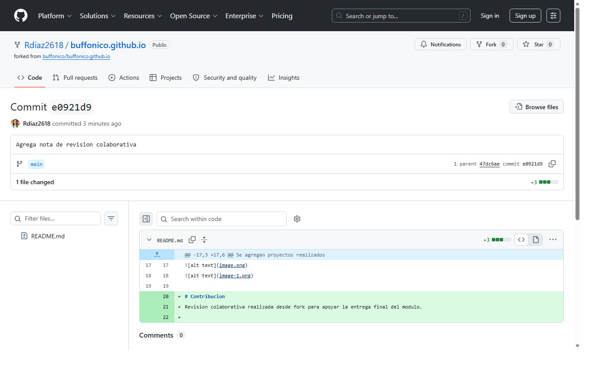
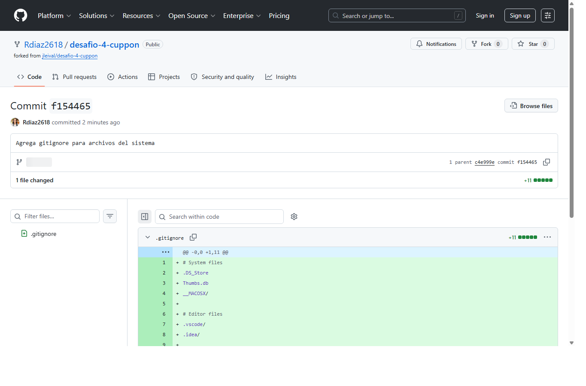
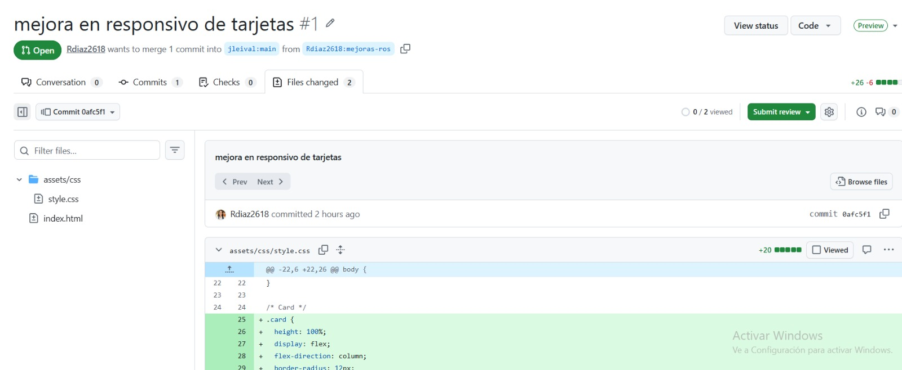

# 💖 Portafolio Web - Roselis Díaz

Portafolio personal desarrollado como parte de mi formación en desarrollo web front-end.

Este proyecto muestra mis habilidades en HTML, CSS y Bootstrap, junto con la implementación de un diseño responsivo y moderno.

---

## 🌐 Demo del proyecto

👉 Puedes ver el portafolio aquí:  
https://rdiaz2618.github.io/rosdiaz2618.github.io/

---

## 🛠️ Tecnologías utilizadas

- HTML5
- CSS3
- Bootstrap 5
- Font Awesome
- Git & GitHub

---

## 📁 Estructura del proyecto
/assets
/css → estilos personalizados
/images → imágenes del portafolio
/pages → páginas internas (portafolio)
/index.html → página principal

## ✨ Características

- Diseño responsivo 📱💻
- Sección de presentación personal
- Portafolio de proyectos
- Habilidades técnicas
- Enlaces a GitHub y contacto
- Uso de Bootstrap para layout

---

## 📌 Proyectos destacados

- Landing page con display-flex astronautas
- Proyecto arriendo toledo (Bootstrap)
- Mi primer CV (Html)

---

## Evidencia de commits colaborativos

### Fork 1: buffonico.github.io

Commit realizado: [e0921d9 - Agrega nota de revision colaborativa](https://github.com/Rdiaz2618/buffonico.github.io/commit/e0921d9)

### Fork 2: desafio-4-cuppon

Commit realizado: [f154465 - Agrega gitignore para archivos del sistema](https://github.com/Rdiaz2618/desafio-4-cuppon/commit/f154465)

---

## 📫 Contacto

- GitHub: [Rdiaz2618](https://github.com/Rdiaz2618)
- Email: tuemail@email.com

---

## 👩‍💻 Autor

Desarrollado por **Roselis Díaz**  
Bootcamp Desarrollo Full Stack - Desafío Latam 🚀

